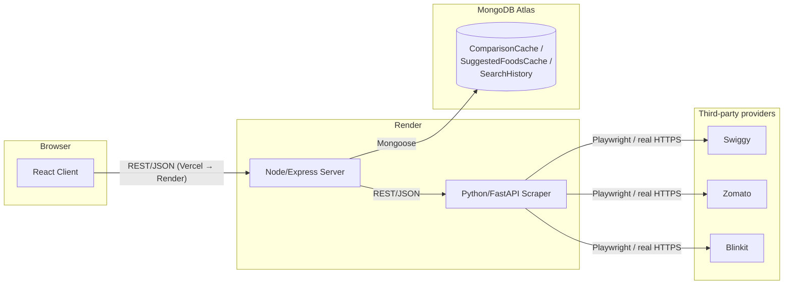

# MealMatch AI — Complete Technical Documentation

> Companion to the root [README.md](../README.md). This document is the
> exhaustive technical reference; the README is the quick-start.

## Table of Contents

1. [Project Introduction](#1-project-introduction)
2. [Problem Statement](#2-problem-statement)
3. [Objectives](#3-objectives)
4. [Features](#4-features)
5. [Tech Stack](#5-tech-stack)
6. [Complete Folder Structure](#6-complete-folder-structure)
7. [Database Design](#7-database-design)
8. [API Documentation](#8-api-documentation)
9. [Frontend Architecture](#9-frontend-architecture)
10. [Backend Architecture](#10-backend-architecture)
11. [Scraper Architecture](#11-scraper-architecture)
12. [Application Workflow](#12-application-workflow)
13. [System Architecture](#13-system-architecture)
14. [Performance Optimizations](#14-performance-optimizations)
15. [Security](#15-security)
16. [Deployment Architecture](#16-deployment-architecture)
17. [Limitations](#17-limitations)
18. [Future Roadmap](#18-future-roadmap)

---

## 1. Project Introduction

MealMatch AI is a three-service web application (React client, Node/Express
API server, Python/FastAPI+Playwright scraper) plus a MongoDB data layer,
built to answer one question fast: *"where is this item cheapest, right
now, near me?"* — across food delivery (Swiggy, Zomato) and grocery
quick-commerce (Blinkit, Zepto), with more providers architected-for but not
yet live-verified (see §17).

## 2. Problem Statement

Comparing prices across delivery apps today requires manually opening each
app, searching the same item repeatedly, and mentally tracking price +
delivery fee + ETA across all of them. Nobody does this consistently, so
price-comparison shopping for food/grocery delivery — despite being
completely mechanical and computer-friendly — is left undone in practice.

## 3. Objectives

- Query multiple delivery/quick-commerce platforms **concurrently**, not sequentially, for a single user search.
- Never fabricate, mock, or cache-substitute price data — every number shown must come from a live scrape.
- Normalize heterogeneous provider responses into one consistent schema.
- Compute an honest, explainable "best deal" (not just cheapest item price — cheapest *effective* cost).
- Degrade gracefully: one provider failing must never break the whole comparison, and the failure must never leak a raw technical error to the user.
- Keep the three services loosely coupled enough that any one can be redeployed, replaced, or extended (new provider) independently.

## 4. Features

See the README's [Features](../README.md#features) section for the user-facing list. From an engineering standpoint, the notable ones:

- **Parallel provider orchestration** via `Promise.allSettled` (server) fanning out to independent Playwright browser contexts (scraper) — one slow/failed provider never blocks the others.
- **Circuit breaker** (`server/src/services/providerHealth.ts`) — after 3 consecutive failures a provider is marked unhealthy and skipped instantly (with cooldown that doubles up to 5 minutes) instead of paying its full timeout on every subsequent request.
- **Session/cookie reuse** in the scraper — Swiggy's WAF-clearing warm-up and Blinkit's location-detection are cached in-memory (short TTL) so repeat requests from the same location don't repeat the full navigation dance.
- **Verified, non-fabricated deep links** — Blinkit's exact product-page URL pattern was confirmed live during development; Swiggy's canonical restaurant URL could not be verified to render correctly headlessly, so it intentionally falls back to a real, working scoped-search URL rather than a guessed link that might 404.

## 5. Tech Stack

### Frontend
- React 19 + TypeScript, Vite 8 (build tool + dev server)
- Tailwind CSS v4 (CSS-first config, `@custom-variant dark` for class-based dark mode)
- Framer Motion (animation)
- TanStack Query v5 (server-state caching/fetching)
- Vitest + Testing Library (component tests)
- oxlint (fast Rust-based linter)

### Backend
- Node.js + Express 5 + TypeScript
- Mongoose (MongoDB ODM)
- Zod (request validation)
- axios (HTTP client to the scraper service)
- express-rate-limit
- Vitest (unit/integration tests, scraper mocked)
- ESLint + typescript-eslint

### Scraper
- Python 3.11 + FastAPI
- Playwright (Chromium, async API) — one shared browser instance per process, a fresh isolated context per request
- Pydantic v2 (request/response schemas)
- pytest + pytest-asyncio

### Database
- MongoDB (Atlas in production; `mongodb-memory-server` as an automatic local-dev fallback when `MONGODB_URI` isn't configured)

### Deployment
- Vercel (client), Render (server, scraper as Docker), MongoDB Atlas (database)

### Tools
- Git, npm workspaces (per-service, not a unified monorepo tool — each service has its own `package.json`/venv), Docker (scraper only)

## 6. Complete Folder Structure

```
MealMatchAI/
├── client/
│   ├── src/
│   │   ├── components/
│   │   │   ├── Navigation.tsx          # header, location trigger, dark-mode toggle
│   │   │   ├── HeroSection.tsx          # search bar, suggestions, popular-search chips
│   │   │   ├── CategoryGrid.tsx         # tappable food category tiles
│   │   │   ├── BestSavings.tsx           # "Popular Near You" live cards
│   │   │   ├── ComparisonPage.tsx        # the core comparison UI (winner banner, provider columns, roadmap cards)
│   │   │   ├── LocationOnboarding.tsx    # first-run + re-open location picker modal
│   │   │   ├── ProviderStatusStrip.tsx   # live per-provider up/down strip
│   │   │   ├── InfoAndReviews.tsx        # "how it works" + FAQ
│   │   │   ├── Footer.tsx
│   │   │   └── __tests__/                # component tests
│   │   ├── hooks/
│   │   │   ├── useGeolocation.ts         # `Coords` type (browser geolocation hook itself was superseded by LocationOnboarding's flow)
│   │   │   ├── useDebouncedValue.ts      # generic debounce hook (used by location search)
│   │   │   └── useMealMatchQueries.ts    # TanStack Query wrappers over lib/api.ts
│   │   ├── lib/
│   │   │   ├── api.ts                    # typed fetch client — the ONLY place that calls the backend
│   │   │   ├── locationStore.tsx         # React Context + localStorage — selected location
│   │   │   ├── themeStore.tsx            # React Context + localStorage — light/dark theme
│   │   │   ├── platforms.ts              # platform metadata registry (colors, names, live vs roadmap)
│   │   │   └── content.ts                # static content: category list, FAQ copy
│   │   ├── types/api.ts                  # TypeScript types mirroring the backend's JSON contracts
│   │   ├── test/setup.ts                 # Vitest setup (matchMedia polyfill, framer-motion mock)
│   │   ├── App.tsx                       # top-level layout/state, code-splits ComparisonPage
│   │   └── main.tsx                      # provider tree: Theme → QueryClient → Location → App
│   ├── index.html                        # blocking inline script sets `.dark` before paint
│   └── .env.example
│
├── server/
│   ├── src/
│   │   ├── routes/                       # thin — validate, call a service, respond
│   │   │   ├── location.ts               # /resolve (reverse geocode), /search (forward geocode)
│   │   │   ├── platforms.ts              # /availability
│   │   │   ├── foods.ts                  # /suggested
│   │   │   ├── compare.ts                # POST /
│   │   │   └── index.ts                  # mounts all of the above under /api
│   │   ├── services/                     # all business logic lives here
│   │   │   ├── compareService.ts         # orchestrates the core comparison flow
│   │   │   ├── suggestedService.ts       # orchestrates "popular near you"
│   │   │   ├── platformsService.ts       # orchestrates availability checks
│   │   │   ├── scraperClient.ts          # HTTP client to the scraper, + retry + circuit breaker
│   │   │   ├── providerHealth.ts         # the circuit breaker's state machine
│   │   │   ├── scoringService.ts         # best-deal calculation + provider sorting
│   │   │   ├── cacheService.ts           # Mongo read/write for cached comparisons & suggestions
│   │   │   ├── historyService.ts         # fire-and-forget search history logging
│   │   │   └── geocodingService.ts       # Nominatim reverse + forward geocoding
│   │   ├── models/                       # Mongoose schemas
│   │   │   ├── ComparisonCache.ts
│   │   │   ├── SuggestedFoodsCache.ts
│   │   │   └── SearchHistory.ts
│   │   ├── middleware/
│   │   │   ├── validate.ts               # Zod-based body/query validation
│   │   │   ├── rateLimiter.ts            # express-rate-limit config
│   │   │   └── errorHandler.ts           # central error → JSON translation
│   │   ├── lib/
│   │   │   ├── AppError.ts               # typed application error class
│   │   │   └── asyncHandler.ts           # wraps async route handlers so rejections reach errorHandler
│   │   ├── config/
│   │   │   ├── env.ts                    # all environment variables, one place
│   │   │   └── db.ts                     # Mongo connection (+ in-memory fallback)
│   │   ├── types/domain.ts               # the canonical TypeScript domain types
│   │   ├── utils/cacheKey.ts             # cache-key normalization (query + coordinate rounding)
│   │   ├── app.ts                        # Express app factory (middleware wiring)
│   │   └── index.ts                      # entrypoint — connects DB, starts the HTTP server
│   └── .env.example
│
├── scraper/
│   ├── app/
│   │   ├── scrapers/
│   │   │   ├── swiggy.py                 # dapi JSON endpoints via a WAF-warmed browser context
│   │   │   ├── zomato.py                 # DOM scraping (unverified live — see §17)
│   │   │   ├── blinkit.py                # DOM-triggered JSON API capture
│   │   │   ├── resilience.py             # UA pool, jitter, retry/backoff, session cache — shared by all three
│   │   │   └── errors.py                 # ScraperError + user-safe message sanitization
│   │   ├── schemas/models.py             # Pydantic request/response models
│   │   ├── core/config.py                # Settings (env-driven)
│   │   ├── api.py                        # FastAPI router — /scrape/{platform}/{availability,search,suggested}
│   │   └── main.py                       # FastAPI app + Playwright browser lifecycle
│   ├── tests/                            # fixture-based parser tests + resilience unit tests
│   ├── Dockerfile                        # Playwright's official base image
│   └── .env.example
│
├── docs/
│   ├── architecture.md                   # original design log / phase-by-phase plan
│   ├── DOCUMENTATION.md                  # this file
│   ├── PROJECT_REPORT.md                 # academic-style report
│   └── DEPLOYMENT.md                     # deployment guide
├── render.yaml
└── LICENSE
```

## 7. Database Design

### Collections

| Collection | Purpose | TTL |
|---|---|---|
| `ComparisonCache` | Caches a full comparison result (all providers) keyed by normalized query + rounded location | 10 minutes |
| `SuggestedFoodsCache` | Caches "popular near you" per location | 45 minutes |
| `SearchHistory` | Append-only log of searches (query, location, timestamp) | none (unbounded — reserved for future analytics, see §18) |

### Document shapes

`ComparisonCache`:
```jsonc
{
  "cacheKey": "milk@12.972,77.595",      // unique index
  "query": "milk",
  "lat": 12.9716, "lng": 77.5946,
  "results": [
    {
      "platform": "blinkit",              // enum: swiggy | zomato | blinkit
      "availability": "available",        // enum: available | not_serviceable | error
      "items": [
        {
          "id": "11173", "name": "...", "restaurantName": "...", "restaurantId": "blinkit",
          "price": 30, "originalPrice": 45, "offerText": "33% OFF",
          "rating": null, "etaMinutes": null, "deliveryFee": null,
          "platformFee": null, "packingFee": null, "distanceKm": null,
          "imageUrl": "...", "itemUrl": "https://blinkit.com/prn/.../prid/11173"
        }
      ],
      "errorCode": null, "errorMessage": null
    }
  ],
  "bestDeal": { "winner": "blinkit", "reasoning": "Blinkit is ₹6 cheaper than Swiggy" },
  "createdAt": "2026-01-01T00:00:00.000Z"   // TTL index field
}
```

`SearchHistory`:
```jsonc
{ "query": "milk", "lat": 12.9716, "lng": 77.5946, "createdAt": "..." }
```

### Indexes

- `cacheKey` — unique index on both cache collections (used for the upsert-by-key pattern in `cacheService.ts`).
- `createdAt` — MongoDB TTL index (`expires: "10m"` / `"45m"` in the Mongoose schema definition) — MongoDB's background TTL monitor deletes expired documents automatically; no application-level cron/cleanup job is needed.

### Caching strategy & data flow

1. A request arrives at `compareService.compare()` with `(query, lat, lng)`.
2. `buildComparisonCacheKey` normalizes the query (lowercase, trimmed, collapsed whitespace) and rounds the coordinates to ~110m precision (`buildLocationKey`) — this means two GPS reads a few meters apart from the same user hit the same cache entry instead of each missing.
3. Cache lookup (`getCachedComparison`) — on **hit**, the cached result is returned immediately (`cached: true`) with **no scraper call at all**.
4. On **miss**, the server calls the scraper for all providers in parallel, computes the winner, **saves** the merged result back to Mongo (`saveComparisonCache`, upsert-by-`cacheKey`), and fires-and-forgets a `SearchHistory` write.
5. MongoDB's TTL index expires the cache document automatically after the configured window — no explicit deletion code exists or is needed.

### Where data is stored / how it expires

All persistent data lives in MongoDB Atlas (or the in-memory fallback locally). Nothing is cached in the browser beyond TanStack Query's in-memory client cache (30s `staleTime`, cleared on refresh) and the two `localStorage` keys (`mealmatch:location`, `mealmatch:theme`) which are user preferences, not price data — prices are never persisted client-side, by design, so a stale price can never be shown from a browser cache.

## 8. API Documentation

Base URL: `{SERVER_URL}/api`. All responses are JSON. All errors follow:
```json
{ "error": { "code": "STRING_CODE", "message": "human-readable message" } }
```

### `GET /location/resolve`

Reverse-geocodes coordinates to a place name (via OpenStreetMap Nominatim).

**Query params:** `lat` (number, -90..90, required), `lng` (number, -180..180, required)

**Example request:** `GET /api/location/resolve?lat=12.9716&lng=77.5946`

**Example response (200):**
```json
{ "displayName": "Bengaluru, Karnataka, India", "city": "Bengaluru", "state": "Karnataka", "lat": 12.9716, "lng": 77.5946 }
```

**Error response (502):** `{ "error": { "code": "GEOCODING_FAILED", "message": "Reverse geocoding failed: ..." } }`

---

### `GET /location/search`

Forward-geocodes a free-text query (city name) to a list of candidate locations.

**Query params:** `q` (string, 2-100 chars, required)

**Example request:** `GET /api/location/search?q=Coimbatore`

**Example response (200):**
```json
{
  "suggestions": [
    { "displayName": "Coimbatore, Tamil Nadu, India", "city": "Coimbatore", "state": "Tamil Nadu", "lat": 11.0018, "lng": 76.9628 }
  ]
}
```

---

### `GET /platforms/availability`

Live per-provider availability check, sorted working-first.

**Query params:** `lat`, `lng` (same validation as above)

**Example response (200):**
```json
{
  "availability": [
    { "platform": "swiggy", "available": true, "errorCode": null, "errorMessage": null },
    { "platform": "blinkit", "available": true, "errorCode": null, "errorMessage": null },
    { "platform": "zomato", "available": false, "errorCode": "BLOCKED", "errorMessage": "Could not reach Zomato: ..." }
  ]
}
```
*(Note: `errorMessage` here is a raw diagnostic string intended for logs/API consumers — the frontend never renders it verbatim; see §15.)*

---

### `GET /foods/suggested`

"Popular near you," sourced live from each platform, sorted working-first.

**Query params:** `lat`, `lng`

**Example response (200):** same shape as `/compare`'s `results[]`, but with the lighter `SuggestedItem` shape (`id`, `name`, `restaurantName`, `price`, `imageUrl` — no fees/rating/ETA).

---

### `POST /compare`

The core endpoint. Given a query and location, returns normalized, sorted, scored results from every live provider.

**Body:**
```json
{ "lat": 12.9716, "lng": 77.5946, "query": "milk" }
```
Validation: `lat` -90..90, `lng` -180..180, `query` 1-100 chars (Zod, `server/src/routes/compare.ts`).

**Example response (200):**
```json
{
  "query": "milk",
  "lat": 12.9716, "lng": 77.5946,
  "results": [
    { "platform": "blinkit", "availability": "available", "items": [ /* ... */ ], "errorCode": null, "errorMessage": null },
    { "platform": "swiggy", "availability": "available", "items": [ /* ... */ ], "errorCode": null, "errorMessage": null },
    { "platform": "zomato", "availability": "error", "items": [], "errorCode": "UPSTREAM_ERROR", "errorMessage": "Provider temporarily disabled after repeated failures" }
  ],
  "bestDeal": { "winner": "blinkit", "reasoning": "Blinkit is ₹6 cheaper than Swiggy" },
  "cached": false,
  "timestamp": "2026-01-01T00:00:00.000Z"
}
```

**Error responses:**
- `400 VALIDATION_ERROR` — malformed body
- `429 RATE_LIMITED` — too many requests from this client in the configured window
- `502 SCRAPER_UNAVAILABLE` — the scraper service itself is unreachable (distinct from an individual *provider* being unreachable, which is a `200` with a per-provider `error` entry, by design — one provider failing is not an application error)

### Error code taxonomy (used across all endpoints)

`TIMEOUT`, `BLOCKED`, `NOT_SERVICEABLE`, `ITEM_NOT_FOUND`, `PARSE_ERROR`, `UPSTREAM_ERROR` — defined once in `server/src/types/domain.ts` and mirrored in `scraper/app/schemas/models.py`. The frontend never branches on the specific code for display purposes (see §15) — it only uses `availability` (`available` / `not_serviceable` / `error`) to decide what to render.

## 9. Frontend Architecture

- **Components** (`src/components/`) — one file per UI concern; `ComparisonPage.tsx` is intentionally the largest since it owns the winner banner, per-provider columns, item rows, roadmap/unavailable cards, and loading skeletons as co-located sub-components (all wrapped in `React.memo`).
- **Hooks** (`src/hooks/`) — `useMealMatchQueries.ts` is the only place that calls TanStack Query's `useQuery`; every data-fetching component goes through it, never `lib/api.ts` directly.
- **Contexts** (`src/lib/locationStore.tsx`, `src/lib/themeStore.tsx`) — both follow the same shape: a `createContext` + provider component + a `useX()` hook that throws if called outside its provider (fail loud in dev rather than silently returning `undefined`).
- **Utilities** (`src/lib/`) — `api.ts` (typed fetch wrapper, the sole network boundary), `platforms.ts` (the platform metadata registry — names, brand colors, live-vs-roadmap status), `content.ts` (static copy: FAQ, categories).
- **Routing** — there is none; this is a single-view app that toggles between a "home" view and a "comparison" view via local component state (`activeQuery` in `App.tsx`), not URL-based routing. A search doesn't produce a shareable/bookmarkable URL today (see §18).
- **Theme** — Tailwind v4 class-based dark mode (`@custom-variant dark`), toggled by adding/removing `.dark` on `<html>`. A blocking inline script in `index.html` applies the stored/system preference before first paint to avoid a flash of the wrong theme.
- **State management** — no global state library (Redux/Zustand); server state lives in TanStack Query's cache, and the only genuinely cross-cutting client state (location, theme) uses plain React Context, which is sufficient at this app's size.

## 10. Backend Architecture

- **Routes** (`src/routes/`) are intentionally thin: validate input (Zod middleware), call exactly one service function, send its return value as JSON. No business logic in a route file.
- **Services** (`src/services/`) hold all business logic. `compareService.compare()` is the orchestrator: cache lookup → parallel scraper calls (`Promise.allSettled`) → sort (`scoringService.sortByPriority`) → score (`scoringService.computeBestDeal`) → cache write → history write → response.
- **Validation** — Zod schemas defined inline per-route; `validateBody`/`validateQuery` middleware parses and either mutates `req.body` or stashes the parsed value on `res.locals.query` (Express 5 made `req.query` a getter with no setter, hence the different handling for query vs body).
- **Provider pipeline** — `scraperClient.ts` is the single chokepoint every provider call goes through: circuit-breaker check → one retry on transient failure → health-state update based on the result. This is where a new provider's HTTP-call plumbing would be added (see §18) — the orchestration in `compareService.ts`/`platformsService.ts`/`suggestedService.ts` only needs its `PLATFORMS` array extended.
- **Error handling** — `AppError` (typed, carries an HTTP status + machine-readable code) thrown anywhere in a service, caught centrally by `errorHandler.ts` middleware and translated to the `{ error: { code, message } }` shape; unexpected exceptions fall through to a generic `500 INTERNAL_ERROR` without leaking a stack trace to the client (though it is logged server-side via `console.error`).

## 11. Scraper Architecture

- **Playwright / browser lifecycle** — one Chromium `Browser` instance is launched at FastAPI startup and kept alive for the process's lifetime (`app/main.py`'s `lifespan` context manager); each individual request creates its own isolated `BrowserContext` (separate cookies/storage) and closes it when done. This amortizes the expensive part (launching Chromium) across all requests while keeping requests isolated from each other.
- **Retry logic** — `resilience.retry_with_backoff()`: exponential backoff (`base_delay * 2^attempt` + random jitter), applied around the actual network-touching call (page navigation or API request) in each provider module, not around the whole request handler.
- **Timeouts** — a single configurable `NAV_TIMEOUT_MS` (default 20s) governs page navigations; Blinkit's in-page search-response wait uses a separate, longer 25s window since it depends on a full client-side interaction (click + type) rather than a direct navigation.
- **Parallel scraping** — the scraper itself handles one request at a time per call, but the *server* fires all provider requests to the scraper concurrently (`Promise.allSettled`), and FastAPI/Playwright/asyncio handle those concurrent in-flight requests as concurrent async tasks sharing the one browser instance (separate contexts, so no cross-request interference).
- **Provider adapters** — `swiggy.py`, `zomato.py`, `blinkit.py` each implement the same three-function interface (`check_availability`, `search`, `suggested`) and are registered in `app/api.py`'s `MODULES` dict — adding a new provider means adding one new module with that interface and one dict entry, nothing else in the scraper needs to change.
- **Resilience helpers** (`resilience.py`, shared by all three adapters):
  - `random_user_agent()` / `random_viewport()` — rotates among a small pool of real, current Chrome/Edge UA strings and common desktop viewport sizes.
  - `jitter()` — a randomized 150-600ms pause before a live request, so concurrent searches don't hit a provider in a synchronized burst.
  - `SessionCache` — an in-memory, TTL'd store of a context's `storage_state` (cookies), so a provider's "warm up" (Swiggy's WAF-clearing homepage visit, Blinkit's location-detection) is reused across requests instead of repeated on every single one.

## 12. Application Workflow

```
User opens the site
        │
        ▼
Location onboarding (if none stored) — "Use Current Location" or search a city
        │  (stored in localStorage + React Context, persists across visits)
        ▼
Homepage — hero search bar, popular-search chips, category grid, "Popular Near You"
        │  (user types a query or taps a chip/category)
        ▼
Client sends ONE POST /api/compare {lat, lng, query} to the backend
        │
        ▼
Backend checks MongoDB cache (10-min TTL, keyed on normalized query + rounded location)
        │
   cache hit ──────────────────────────────► return cached result immediately
        │ cache miss
        ▼
Backend fires parallel requests to the scraper for every live provider
(Swiggy, Zomato, Blinkit) — Promise.allSettled, one provider's failure/timeout
never blocks the others
        │
        ▼
Scraper: for each provider — check circuit breaker → (retry+backoff on transient
failure) → real Playwright browser interaction with the provider's site →
normalize the extracted data into the shared MenuItem schema
        │
        ▼
Backend normalizes all provider responses into one ComparisonResult shape,
sorts providers (working-first, cheapest-first), computes the best deal
(cheapest price+fees, ETA as tiebreaker), writes the cache entry, logs
search history
        │
        ▼
Response returns to the client
        │
        ▼
UI renders: animated winner banner (with confetti + savings amount),
provider columns (working providers first), a separate "Unavailable" section
for failed/roadmap providers with clean generic messages — never a raw error
        │
        ▼
User clicks a product's "Open" action → opens that EXACT item on the
provider's own site in a new tab (or is visibly disabled with a tooltip if no
reliable deep link exists) — the original tab/SPA state is untouched, so
returning to it (or hitting the browser back button) shows the app exactly as
it was
```

## 13. System Architecture



End-to-end request path for a search: **Browser → Vercel-hosted static
client → Render-hosted Express server → Render-hosted FastAPI scraper →
provider websites (live, real browser) → back up the same chain, normalized
at the server, cached in Atlas along the way.**

## 14. Performance Optimizations

- **Lazy loading** — `ComparisonPage` is `React.lazy`-loaded (code-split into its own JS chunk, confirmed via the production build output — see §16); all item images use `loading="lazy"`.
- **Caching** — MongoDB-backed response cache (10/45-min TTL) avoids re-scraping identical (query, location) pairs; TanStack Query's client-side cache (30s `staleTime`) avoids redundant re-fetches within a session.
- **Memoization** — `ItemRow`, `PlatformColumn`, `RoadmapCard` are all `React.memo`-wrapped so a re-render of the parent (e.g. a `useState` update in `ComparisonPage`) doesn't re-render every item row in a 90-item list.
- **Parallel requests** — every multi-provider call (`compare`, `availability`, `suggested`) uses `Promise.allSettled`, never a sequential loop.
- **Skeleton loading** — a shimmer-animated placeholder grid renders during the comparison fetch instead of a bare spinner, using a previously-defined-but-unused CSS keyframe (`animate-shimmer`) that's now actually wired up.
- **Code splitting** — confirmed in the Vite production build: `ComparisonPage` compiles to its own ~18kB chunk, separate from the ~400kB main bundle, so the home page's initial load doesn't pay for comparison-page code it isn't using yet.
- **Scraper-side** — session/cookie reuse (see §11) turns a cold ~30-60s multi-provider search into a ~3-4s one on the next request from the same location, empirically measured during development.

## 15. Security

- **CORS** — a single allowed origin, configured via `CORS_ORIGIN` (not wildcarded) — see `server/src/app.ts`. In production this is set to the exact Vercel deployment URL.
- **Environment variables** — all secrets (Mongo URI, service URLs) are environment-variable-only, never hardcoded; `.env` is git-ignored project-wide; `.env.example` files document required keys without real values.
- **Input validation** — every route validates its input with Zod before touching any service logic (lat/lng bounds, query length limits) — malformed requests never reach the database or the scraper.
- **Rate limiting** — `express-rate-limit` applied to the entire `/api` router (default: 30 requests / 60s per client), returning a structured `429 RATE_LIMITED` rather than allowing unbounded load.
- **Error handling / information disclosure** — the backend's raw `errorMessage` (which can contain diagnostic detail like a Playwright call log) is present in the **API** response for debugging/observability, but the **frontend never renders it** — `ComparisonPage.tsx`'s `unavailableMessage()` maps every failure to one of two generic, safe strings ("Currently Unavailable" / "No Results Available") regardless of the underlying `errorCode`, so no internal stack trace, selector name, or network error ever reaches an end user's screen. This is enforced by an automated test (`ComparisonPage.test.tsx`: *"never renders a raw technical error message, regardless of error code"*).
- **No user accounts / no PII collected** — the app doesn't have authentication; the only stored personal-ish data is coarse GPS coordinates (rounded to ~110m for caching) and search text, neither tied to an identity.
- **Scraper behavior** — resilience techniques (UA rotation, jitter, retries) operate only on the scraper's *own* outbound request behavior; nothing here attempts to bypass authentication, defeat CAPTCHAs, or use proxies/VPNs to evade a provider's block — see the explicit policy comment at the top of `scraper/app/scrapers/resilience.py`.

## 16. Deployment Architecture

See [`docs/DEPLOYMENT.md`](DEPLOYMENT.md) for the full step-by-step guide.
Summary of how a request travels in production:

1. Browser loads the static client from Vercel's CDN.
2. Client's `fetch` calls go to `VITE_API_BASE_URL` (baked in at Vercel build time) — the Render-hosted Express server.
3. Express server calls `SCRAPER_SERVICE_URL` — the Render-hosted, Dockerized FastAPI/Playwright service — over plain HTTPS.
4. Express server reads/writes MongoDB Atlas via `MONGODB_URI` (mongodb+srv, TLS by default).
5. The scraper makes real outbound HTTPS requests to Swiggy/Zomato/Blinkit from Render's network.

Each hop is a plain environment-variable-configured URL — no service hardcodes another's address, so any one leg (e.g. moving the scraper to a different host due to Playwright's resource needs) can change without touching the others.

## 17. Limitations

Stated plainly, not hidden:

- **Only 4 of the ~11 commonly-requested providers are actually live-scraped** (Swiggy, Zomato, Blinkit, Zepto). Instamart and BigBasket have scraper modules implemented and registered in the scraper service, but are not yet promoted to `live` in the frontend registry pending further verification. JioMart, Magicpin, EatSure, ONDC, and Rapido Food are registered in the UI as visible "Coming Soon" cards, not faked with placeholder data.
- **Zomato could not be verified live during this project's development** — this development network is blocked by Zomato's edge at the TLS/network level (confirmed via both `curl` and a real headless browser; every other tested site, including Swiggy, loads normally). Zomato's DOM selectors are therefore best-effort and unverified against the live site.
- **Live scraping is inherently fragile.** Swiggy, Zomato, and Blinkit can all change their DOM structure or API response shape at any time without notice, which would silently break extraction until the code is updated — there is no automated alerting for this beyond the scraper's own error-rate becoming visible in logs.
- **Delivery/platform/packing fees are usually `null`.** None of the three providers' public search endpoints expose these — they're computed at checkout — so the "final cost" formula supports them but has real data to add in only sparingly (Swiggy exposes no fee at all; Blinkit and Zomato similarly don't expose it pre-checkout).
- **No exact product-page deep link for Swiggy or (unverifiably) Zomato.** Swiggy's SPA doesn't server-render a restaurant page at any URL this project could get to resolve correctly headlessly, so its "Open" link is a scoped search rather than the literal item page — an intentional, disclosed trade-off rather than a fabricated link.
- **Domain-shape duplication.** The same conceptual schema (a menu item, a platform result) is hand-maintained in three places — TypeScript (`server/src/types/domain.ts`), Python/Pydantic (`scraper/app/schemas/models.py`), and Mongoose (`server/src/models/*.ts`). Nothing enforces these staying in sync automatically; a real bug from exactly this (a stale platform `enum` in the Mongoose cache schema silently stripping new fields from cached responses) was found and fixed during this release's polish pass — see the commit history — but the underlying architectural risk (another field added to one without the others) remains.
- **No authentication, no user accounts, no order history, no ability to actually place an order** — this is a comparison layer only; completing a purchase happens on the provider's own site/app.
- **No production monitoring/alerting** is wired up (e.g. Sentry, uptime pings) — Render's own dashboard logs are the only current observability surface.

## 18. Future Roadmap

- **More live providers** — Instamart and BigBasket already have scraper modules built (same interface as Zepto/Blinkit); promoting them to `live` just needs verification against real traffic and flipping their status in `client/src/lib/platforms.ts`.
- **AI-powered recommendations** — using search history (already logged, currently unused beyond storage) to suggest items/cravings.
- **Coupon/offer aggregation** — surfacing provider-side promo codes where discoverable, beyond the MRP-vs-price discount already shown for Blinkit.
- **Shareable/bookmarkable search URLs** — introduce client-side routing so a comparison result has its own URL.
- **Native mobile apps** — the existing REST API is already platform-agnostic; a React Native or native client could reuse it directly.
- **Usage analytics dashboard** — `SearchHistory` already captures every search; there's no reporting/dashboard built on top of it yet.
- **Personalization** — location-aware default sort, remembered dietary preferences, etc.
- **CI/CD** — automated test/build/deploy pipeline (e.g. GitHub Actions) triggering on push, currently deploys are manual per the steps in `docs/DEPLOYMENT.md`.
- **Schema-sharing tooling** to close the domain-duplication gap noted in §17 (e.g. generating the Mongoose schema and/or Pydantic models from a single source of truth).
